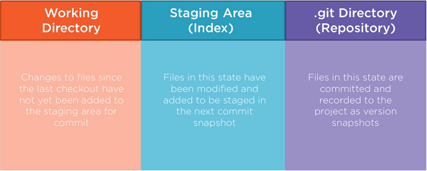

[<< Back to The Basics](index.md)

# Git
Git is a distributed version control system.  It is the most popular DVCS available today and was created by Linus Torvalds in 2005.

# Under the Hood
At the most fundamental level, Git is a persistent map or hash set, assigning some data to key values.  The all-important key value is the SHA1 hash, which is a 40-character check-summed value generated from the content of a node as well as the node's parents.  For all intents and purposes, SHA1 values are unique across the entire known universe.

Git acts similarly to a file system, in that it stores snapshots of the entire project at each commit.  Umodified files do not get stored again but reference the most recent version of that file.  Because Git stores all snapshots, commits and history locally, most operations are very fast.

## Git Projects
Git uses the following project structure:

- **.git Directory** The compressed repository and its metadata
- **Working Directory** A single copy of the project (a checkout), pulled from the .git directory
- **Staging Area (Index)** Sits between working directory and git directory. Stages fixes that will be committed, which will then be committed back to the .git directory.

## Git Objects
Git has only a handful of base object types it uses to store information in its database:

- **Blobs** An arbitrary bit of content
- **Trees** Equivalent of directories
- **Commits** Versioning information
- **Annotated Tags** A label

In the end, Git was designed very similarly to a higher-level file system, mimicking the behavior of files, directories and links. 

## File Stages

- **Untracked** Files are not tracked by Git
- **Committed** Files are tracked by Git.
- **Modified** Changes to a file have been made.  WIP.
- **Staged** Changes are committed to local database.

# Commands

## Porcelain Commands
- `git --version` Version information
- `git config` Interact with configuration settings
- `git config --global` Interact with global configuration settings
- `git help` Quick command overview
- `git init` Create a new repo.
- `git clone` Clone entire repo to local environment
- `git pull` Retrieve latest commits from remote repository
- `git branch` Create a branch
- `git checkout` Go back / forward in time to a previous version
- `git status` Show the status of changed files
- `git add` Add files the staging area
- `git rm` Delete file
- `git rm --cached` Remove a file from git tracking
- `git mv` Move or rename
- `git stash` Stash changes
- `git stash pop` Pop off stashed changes to working tree
- `git diff` Show file differences between commits
- `git merge` Merge changes from one branch to another
- `git reset` Undo changes in the project structure
- `git commit` Commit local changes to the repository
- `git commit -a` Auto stage all local changes and commit
- `git commit -m "<msg>"` Add commit message
- `git push` Push commits to a remote repository
- `git log` Show a log of commits
- `git tag -a <TagName>` Create a tag

## Plumbing Commands
- `git hash-object` Print the SHA1 hash for some bit of content
- `git cat-file -p` Show the contents of a git database object
- `git count-objects` Counts the quantity and space of git database objects