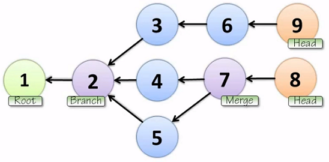
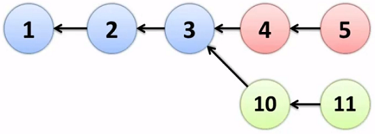
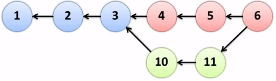

[<< Back to The Basics](index.md)

# Version Control
(Todo)

The first generation of version control used file locking (SCCS, RCS).  The second generation become centralized, allowing concurrent edits and requiring merges before commit (CVS, Vault, TFS, etc).  In the third generation, version control became distributed (Mercurial, Git, etc).

# Distributed Version Control

## Directed Acyclic Graph (DAG)
A graph is composed of nodes and edges.  Some edges are directed, signifying a parent-child relationship.  A node with no parents is a root.  A child can also be called a branch.  When a node has more than one parent, it is a merge.  A node with no children is called a head.  In an acyclic graph, you cannot return to your node of origin by following the directed edges in the graph:

In a distributed version control system, each node represents a commit.  Each node has information about the changes that were made, as well as who its parents are.  A node is identified by a hashed ID value (typically SHA-1) that is generated based on the changes in the commit as well as the parent-child relationships.  A change to a commit node requires a new hash to be calculated.

## Cloning
A distributed version control system does not require a central server where the latest code is found, but in real-world applications, this often is the case.  

In centralized systems, retrieving the latest code entails copying the most recent versions of the sources files to the local development environment.  However, in a distributed system, a clone operation is performed, which brings the entire directed acycilic graph onto the local machine.  This approach is highly optimized for speed and performance, requiring less disc space than you would think.  This is the power of a distributed system, as as any machine that has cloned a repository can recreate that repositority in its entirety.

## Commits
In a distributed system, commits are at first local-only.  The new commit node has not been added to a central server or any other machine where the cloned repository resides.  When local commits are ready to be integrated with any centralized environment, those changes must be pushed to that environment.  

When new, concurrent changes have been made to the central server, a pull or fetch must be invoked.  This operation brings new additions to the local environment.  Often, this creates a conflict between the local environment and the latest version of code that was pushed to the central server.  

Because a node cannot change parents without a change in the hash, a conflict creates multiple heads:

In this case, the parent-child relationships have been preserved in each set of changes (nodes 4 and 10).  However, multiple heads are a problem.  For example, a build server would not be able to determine which head is the most recent version of the software to build or deploy. 

In this case, a merge must be performed, which is a new commit that draws both sets of changes together, restoring a single head in the repository while continuing to preserve the existing parent-child relationships:

Just like before, this merge remains a local commit until it is pushed to the central server. 

# Open Source
The following features of distributed version controls system are especially helpful for open source projects and workflows:

- Forks
- Pull Requests
- Branches

A typical for contributing to an open source project is:

- Fork the project
- Clone the repository locally
- Make a change (probably in a branch)
- Commit and push to the fork
- Issue a pull request from the fork to the original project